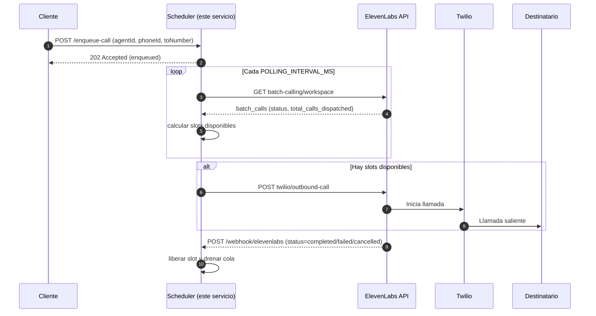

## Voice Slot Scheduler

### El problema
Las plataformas de voz (p. ej., ElevenLabs) aplican límites de concurrencia para proteger su infraestructura. Si tu app marca muchas llamadas a la vez (campañas, reintentos, picos), puedes superar esos límites y provocar:
- Errores intermitentes y timeouts
- Llamadas rechazadas o fallidas
- Experiencia de usuario inconsistente y costos impredecibles

### Por qué es importante
Controlar el ritmo de llamadas mantiene la fiabilidad del sistema, evita rate limits, estabiliza costos y asegura una experiencia de voz consistente. Además, desacopla a tus productores de eventos del proveedor de voz, agregando backpressure donde hace falta.

### La solución
Este servicio en Node/TypeScript actúa como un despachador con cola: encola peticiones de llamada, monitorea cuántas están activas en ElevenLabs y solo libera nuevas cuando hay slots disponibles. Integra llamadas salientes vía Twilio (Agents Platform) y libera slots al recibir webhooks de finalización.

### Características
- **Cola en memoria con prioridad**: encola peticiones cuando no hay slots.
- **Scheduler con polling**: consulta periódicamente el número de llamadas activas en ElevenLabs.
- **Webhooks**: endpoint para marcar llamadas finalizadas y liberar slots.
- **Endpoints HTTP**: para encolar, ver métricas y recibir webhooks.

### Diagrama (secuencia)


### Integración con ElevenLabs y Twilio
- Llamadas salientes: **Twilio outbound-call** de ElevenLabs
  - Endpoint: `POST /v1/convai/twilio/outbound-call`
  - Header: `xi-api-key`
  - Doc: [Outbound call](https://elevenlabs.io/docs/api-reference/twilio/outbound-call)
- Conteo de llamadas "activas": **Batch Calling List** de ElevenLabs
  - Endpoint: `GET /v1/convai/batch-calling/workspace`
  - Estados de batch: `pending`, `in_progress`, `completed`, `failed`, `cancelled` (se consideran activas las `in_progress` por defecto, configurable por env)
  - Estrategia de conteo configurable:
    - `dispatched`: suma `total_calls_dispatched` en batches activos
    - `batches`: cuenta 1 por batch activo
  - Doc: [Batch Calling List](https://elevenlabs.io/docs/agents-platform/api-reference/batch-calling/list)
- Webhooks: este servicio libera slots cuando recibe `completed`, `failed` o `cancelled`.

### Suposiciones
- Usaremos **ElevenLabs (Agents Platform)** como proveedor de voz.
- Usaremos **Twilio** (vía ElevenLabs outbound-call) para conectar las llamadas salientes.
- Guardaremos **listados/cola en memoria** en este prototipo; en la implementación final deben persistirse en **DB/Redis**.
- El **límite de concurrencia** lo proveerás por configuración (env var `ELEVENLABS_CONCURRENCY_LIMIT`).

### Requisitos
- Node 18+ (o superior)

### Instalación
```bash
npm install
```

### Variables de entorno
Crear un archivo `.env` en la raíz con al menos:
```bash
# Puerto HTTP del servicio
PORT=4000

# Límite de concurrencia permitido en ElevenLabs (p. ej. 5)
ELEVENLABS_CONCURRENCY_LIMIT=5

# Frecuencia de polling para leer llamadas activas (ms)
POLLING_INTERVAL_MS=2000

# API Key de ElevenLabs
ELEVENLABS_API_KEY=xxxxxxxxxxxxxxxx

# Endpoint para listar batch calling en ElevenLabs (usado para estimar "activas")
# Docs: https://elevenlabs.io/docs/agents-platform/api-reference/batch-calling/list
ELEVENLABS_ACTIVE_CALLS_URL=https://api.elevenlabs.io/v1/convai/batch-calling/workspace

# Endpoint para iniciar llamada vía Twilio (Agents Platform)
# Docs: https://elevenlabs.io/docs/api-reference/twilio/outbound-call
ELEVENLABS_START_CALL_URL=https://api.elevenlabs.io/v1/convai/twilio/outbound-call

# Opcional: secreto para validar webhooks
WEBHOOK_SECRET=

# Opcional: estrategia para contar "activas" desde batch calls
# - ELEVENLABS_ACTIVE_STATUSES: estados que se consideran activos (por defecto: in_progress)
# - ELEVENLABS_ACTIVE_COUNT_STRATEGY: dispatched|batches (por defecto: dispatched)
ELEVENLABS_ACTIVE_STATUSES=in_progress
ELEVENLABS_ACTIVE_COUNT_STRATEGY=dispatched
```

> Nota: los endpoints exactos de ElevenLabs pueden variar según el producto (Realtime/Agents/Telephony). Este servicio es agnóstico y los URLs son configurables. Para batch calling, este servicio usa `GET /v1/convai/batch-calling/workspace` y considera como activas las llamadas según la estrategia configurada. Consulta la documentación oficial de ElevenLabs para la lista de batch calls: [Batch Calling List](https://elevenlabs.io/docs/agents-platform/api-reference/batch-calling/list).

### Desarrollo
```bash
npm run dev
```

### Build y ejecución
```bash
npm run build
npm start
```

### Tests
- Requiere Node 18+ (usa `fetch` nativo y Vitest).
```bash
npm run test
# o en watch
npm run test:watch
```

### Endpoints
- `GET /health`: healthcheck.
- `GET /stats`: estado actual del scheduler.
- `POST /enqueue-call`: encola una llamada (Twilio outbound-call).
  - Body JSON:
    ```json
    {
      "payload": {
        "agentId": "AGENT_ID",
        "agentPhoneNumberId": "PHONE_NUMBER_ID",
        "toNumber": "+15551234567",
        "conversationInitiationClientData": { "orderId": "123" }
      },
      "priority": 0
    }
    ```
  - Respuesta: `{ "enqueued": true, "id": "...", "queueSize": 1 }`
- `POST /webhook/elevenlabs`: webhook para eventos de ElevenLabs.
  - Body JSON esperado (flexible): `{ "conversation_id"|"callSid"|"callId": "...", "status": "completed" }`
  - Estados que liberan slot: `completed|failed|cancelled`

### Cómo funciona
1. El scheduler hace polling a `ELEVENLABS_ACTIVE_CALLS_URL` para conocer cuántas llamadas están activas en ElevenLabs.
2. Calcula los slots disponibles: `ELEVENLABS_CONCURRENCY_LIMIT - llamadas_activas_remotas - llamadas_envuelo_locales`.
3. Si hay slots libres, despacha elementos de la cola y ejecuta `ELEVENLABS_START_CALL_URL` (Twilio outbound-call). Se envían los campos `agent_id`, `agent_phone_number_id`, `to_number` y opcionalmente `conversation_initiation_client_data`.
4. Cuando ElevenLabs envía un webhook `ended/completed/...`, el servicio libera el slot localmente.

### Persistencia
Actualmente la cola es **en memoria**. Para producción, considera Redis/BullMQ o una base de datos para persistencia y resiliencia.

### Seguridad de webhooks
Si configuras `WEBHOOK_SECRET`, puedes extender `POST /webhook/elevenlabs` para validar firmas HMAC según lo que exponga ElevenLabs.

### Notas sobre conteo de activas
- Por defecto se usa el listado de **Batch Calling** y se considera activo cuando `status` está en `ELEVENLABS_ACTIVE_STATUSES` (por defecto: `in_progress`).
- La estrategia `ELEVENLABS_ACTIVE_COUNT_STRATEGY=dispatched` suma `total_calls_dispatched` de esos batches; `batches` cuenta 1 por batch.
- Si prefieres otra fuente para el conteo (p. ej., conversaciones en vivo), ajusta `ELEVENLABS_ACTIVE_CALLS_URL` y el parser en `ElevenLabsClient`.

Estados de Batch Calling según documentación: `pending`, `in_progress`, `completed`, `failed`, `cancelled`. Ver referencia: [Batch Calling List](https://elevenlabs.io/docs/agents-platform/api-reference/batch-calling/list).

### Licencia
MIT
